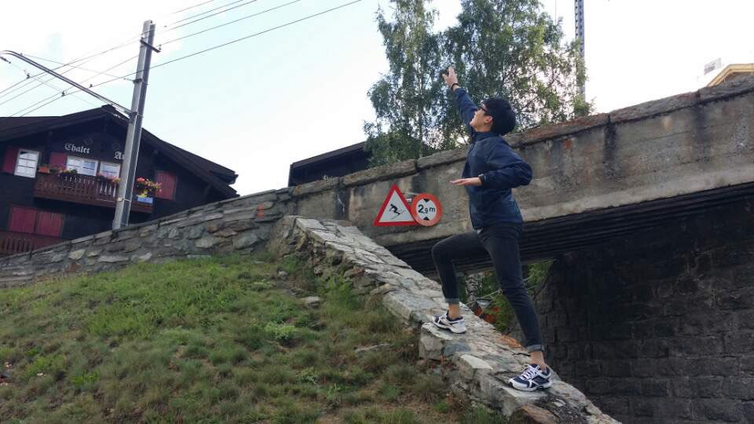

<!---->

I'm Chanho Eom, a student at the School of Electrical & Electronic Engineering, Yonsei Univeristy, Seoul, Korea, under the supervision of Prof. [Bumsub Ham](https://cvlab.yonsei.ac.kr). 

My research interests include computer vision and machine/deep learning, particularly image/video retrieval, domain adaptation, and monocular depth estimation.

# Educations
_________________
* (Mar. 2017 ~ present)   : **Ph.D candidate** at the School of Electrical & Electronic Engineering, Yonsei Univeristy, Seoul, Korea.
* (Mar. 2012 ~ Feb. 2017) : **B.S**. at the School of Electrical & Electronic Engineering, Yonsei Univeristy, Seoul, Korea.

# Publications
_________________
### Journal
* **Disentangled Representations for Short-Term and Long-Term Person Re-identification**  
**Chanho Eom**, Wonkyung Lee, Geon Lee, and Bumsub Ham.  
*IEEE Trans. Pattern Anal. Mach. Intell. ([TPAMI](https://ieeexplore.ieee.org/xpl/RecentIssue.jsp?punumber=34)) (IF: 17.861)* (accepted)  
\| [project](https://cvlab-yonsei.github.io/projects/ISGAN/)
\|

* **Temporally Consistent Depth Prediction with Flow-Guided Memory Units**.\
**Chanho Eom**, Hyunjong Park and Bumsub Ham.\
*IEEE Trans. Intell. Transp. Syst. ([TITS](https://ieeexplore.ieee.org/xpl/RecentIssue.jsp?punumber=6979)) (IF: 6.319)*, vol. 21, no. 11, pp. 4626-4636, Nov. 2020.  
\| [project](https://cvlab-yonsei.github.io/projects/FlowGRU/)
\| [paper](https://ieeexplore.ieee.org/document/8848860)
\| [code](https://github.com/cvlab-yonsei/FlowGRU)
\|

### Conference
* **Video-based Person Re-identification with Spatial and Temporal Memory Networks**  
**Chanho Eom**, Geon Lee, Junghyup Lee, and Bumsub Ham.  
*IEEE Int. Conf. Comput. Vis. ([ICCV](https://iccv2021.thecvf.com/home))*, Oct. 2021.  
\| [project](https://cvlab.yonsei.ac.kr/projects/STMN/)
\| [paper](https://openaccess.thecvf.com/content/ICCV2021/papers/Eom_Video-Based_Person_Re-Identification_With_Spatial_and_Temporal_Memory_Networks_ICCV_2021_paper.pdf)
\| [code](https://github.com/cvlab-yonsei/STMN)
\|

* **Learning Disentangled Representation for Robust Person Re-identification**  
**Chanho Eom** and Bumsub Ham.  
*Adv. Neural Inf. Process. Syst. ([NeurIPS](https://nips.cc/Conferences/2019))*, Dec. 2019.  
\| [project](https://cvlab-yonsei.github.io/projects/ISGAN/)
\| [paper](https://papers.nips.cc/paper/2019/file/d3aeec875c479e55d1cdeea161842ec6-Paper.pdf)
\| [code](https://github.com/cvlab-yonsei/ISGAN)
\|

# Invited Talks
_________________
* Korean Conference on Computer Vision (KCCV), oral/poster presentations, Aug. 2020.
* Naver CLOVA AI Tech Talk, Jan. 2020. ([video](https://www.youtube.com/watch?v=_bQvGy80MS0) \| [slides](https://www.facebook.com/677413542326125/posts/3110595645674557/))
 
# Awards
_________________
* **Excellence Paper Award**, *Workshop on Signal Processing 2021, The Institute of Electronics and Information Engineers (IEIE).*
* **Travel Award**, *Adv. Neural Inf. Process. Syst. (NeurIPS)* 2019.
* **Best Paper Award**, *Workshop on Frontiers of Electrical Engineering (FREE) 2019, Yonsei University.*

# Projects
_________________
* The Development of Camera-based Human Attribute Recognition Method for Improving Robot Cognitive Ability,  
*Hyundai Motors, Apr. 2021 ~ Apr. 2022.*  
* FlexNet: Overcoming Limitations of Deep Learning for Flexible Semantic Image Segmentation,  
*National Research Foundation of Korea (NRF), Mar. 2021 ~ Feb. 2022.*  
* Deep Identification and Tracking of Missing Person in Heterogeneous CCTV,  
*National Research Foundation of Korea (NRF), Oct. 2018 ~ Jun. 2023.*  

# Patents
_________________
### International
* Person Re-identification Apparatus and Method  
*17/003, 990, Aug. 2020. (Application)*

* Device and Method for Estimating Depth of Monocular Video  
*PCT/KR2019/018413, Dec. 2019. (Application)*

### Domestic
* Device and Method for Estimating Depth of Monocular Video  
*10-2019-0156863, Jun. 2021. (Registration)*

* Person Re-identification Apparatus and Method  
*10-2019-0104887, Mar. 2021. (Registration)*

# Experience
_________________
* **Research Engineer** at [SENSORWAY](http://www.sensorway.co.kr/eng/), Seoul, Korea  
*Jun. 2015 ~ Feb. 2016*
  - Participated in projects on Perimeter Intrusion Detection System (PIDS) for security solution
* **Exchange Student** in [University of California, Santa Barbara](https://www.ucsb.edu/), United States  
*Jan. 2015 ~ Jun. 2015*

# Professional Activities
_________________
* Reviewers  
IEEE Trans. Patter Anal. Mach. Intell. (TPAMI)  
IEEE Trans. Image Process. (TIP)  
IEEE Trans. Multimedia (TMM)  
Int. Jour. Comput. Vis. (IJCV)  
In Proc. IEEE Conf. Comput. Vis. Pattern Recognit. (CVPR) 2020/2021/2022  
In Proc. IEEE Int. Conf. Comput. Vis. (ICCV) 2019/2021  
In Eur. Conf. Comput. Vis. (ECCV) 2020  
In AAAI Conf. Artificial Intelligence (AAAI) 2020  

# Teaching
_________________
* Teaching assistant at the School of Electrical & Electronic Engineering, Yonsei Univeristy.  
2019-1: Signal Processing Lab (EEE4423)  
2018-2: Aritifial Intelligence (EEE3314)  
2017-1: Data Structure and Algorithms (EEE2020)

